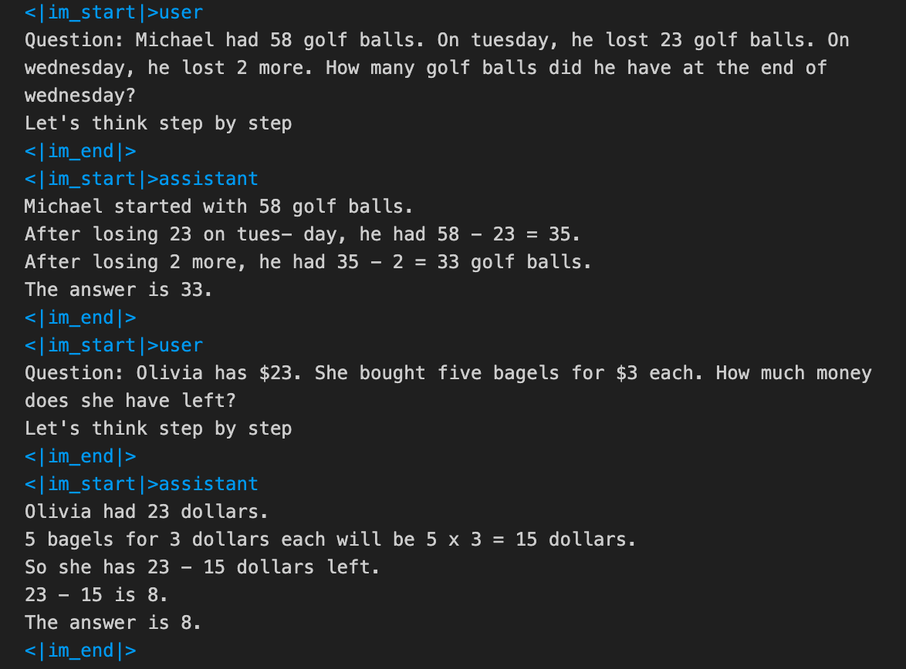

# CotHub Standard Prompt Library (CotHub SPL)

Yao Fu. University of Edinburgh. Jun 2023.

There are so many LLM model families (GPT, Claude, PaLM, LLaMA, .etc), so many prompt engineering techniques (few-shot, zero-shot, CoT, .etc). How to nevigate through this space? 

We introduce the **CotHub Standard Prompt Library (CotHub SPL)**, a collection of standard prompts serving as the starting point for advanced prompt engineering for solving very complex tasks.
We construct this library because we envisage that large language models will become the next-generation computational platform, just like operating systems. 
Traditional operating systems have standard libraries like **C++ STL**.
We hope that **CotHub SPL** will become the C++ STL for LLMs.

The CotHub SPL consists of two parts:
* A collection of standard prompts for reproducible research and engineering. See the folder `gsm8k` as an example.
* A Standard Prompt Schema (SPS) specifying rules for constructing new standardized prompt libraries, which we explain below. 

## CotHub Standard Prompt Schema (CotHub SPS)

When constructing standard prompts, we should consider:
* Two types of models: 
    * Models before being tuned into a chatbot, including
        * Pretrained checkpoints, e.g., LLaMA 65B
        * Non-chat instruction tuned checkpoints, e.g., `text-davinci-003`
        * For models that are not tuned into a chatbot, we use more "raw" prompts that are better suited for prompt completion.
    * Models that are tuned into a chatbot, e.g., `gpt-3.5-turbo`
        * For models that are tuned into a chatbot, we need to change our prompt format to be more like a conversation. 
        * We follow the [OpenAI ChatML](https://github.com/openai/openai-python/blob/main/chatml.md) format to organize the prompts. 
        * We provide scripts to load the prompts and transform them into other dialog format (e.g., the Claude format).
    * For in-context learning, completion models and chatbot models require different prompt formatting. 
* Two types of prompts
    * Few-shot in-context learning: this is suitable for all types of models (pretrained and aligned). Also the performance is usually better than zero-shot. **We always recommend using few-shot in-context learning for production**. 
    * Zero-shot instruction: this is suitable for models after alignment because pretrained checkpoints may not necessarily follow the zero-shot instructions.
    * Few-show in-context learning if developer-oriented, while zero-shot is user-oriented. Few-shot tests the full potential of the model, while zero-shot reveals model performance as a chatbot.
* Two types of outputs
    * Direct Answering: this is suitable for all types of models/ tasks (small or large, knowledge or reasoning).
    * Chain of Thought: prepending the reasoning process before getting an answer. This is suitable for reasoning (not reasoning) tasks.
    * CoT does not always outperform direct answering because:
        * Some tasks, like knowledge-oriented tasks, does not require reasoning.
        * Small models' CoT performance is significantly worse than large models. The model has to be strong enough to do CoT.

Given the above considerations, we propose the following schema for constructing standardized prompt libraries. We use GSM8K as an example.

```plaintext
gsm8k
|--chat                             # prompt for chatbot models, .chatml format
|  |--few_shot_cot.chatml
|  |--few_shot_direct.chatml
|  |--zero_shot_cot.chatml
|  |--zero_shot_direct.chatml
|  
|--completion                       # prompt for completion models, .txt format
|  |--few_shot_cot.txt
|  |--few_shot_direct.txt
|  |--zero_shot_cot.txt
|  |--zero_shot_direct.txt

```

## Example Usage 

```Python
import openai

from spl import load_prompt
# TODO: finish this example
```

See `example_gsm8k.ipynb` for more detailed comparison of different prompts.

## Prompt Optimization

The CotHub SPL does not perform prompt optimization -- we aim for standardized baselines and development environments, rather than the best performance. We leave prompt optimization to the developers.

Yet we do encourage prompt optimization during development, because one always wants the best performance for production. 

At the current stage, prompt optimization is still an art and an active research field. One example is to use complex prompts, i.e., prompt of more reasoning steps, over simpler ones. See folder `gsm8k/optimized` for an example. Also see Lilian Weng's [prompt engineering](https://lilianweng.github.io/posts/2023-03-15-prompt-engineering/) blog for a tutorial.

## Better Visualization

If you are using VSCode, you can use the following settings to make the `.chatml` prompts more readable. 

Step 1. Download the [TODO Highlight](https://marketplace.visualstudio.com/items?itemName=wayou.vscode-todo-highlight) extension

Step 2. Add the following settings to your VSCode `settings.json` file:

```json
"todohighlight.keywords": [
        {
            "text": "<|im_start|>user",
            "backgroundColor": "rgba(0, 0, 0, 0)",
        },
        {
            "text": "<|im_start|>assistant",
            "backgroundColor": "rgba(0, 0, 0, 0)",
        },
        {
            "text": "<|im_start|>system",
            "backgroundColor": "rgba(0, 0, 0, 0)",
        },
        {
            "text": "<|im_end|>",
            "backgroundColor": "rgba(0, 0, 0, 0)",
        },
    ]
```

Then you could view your prompt like this:

